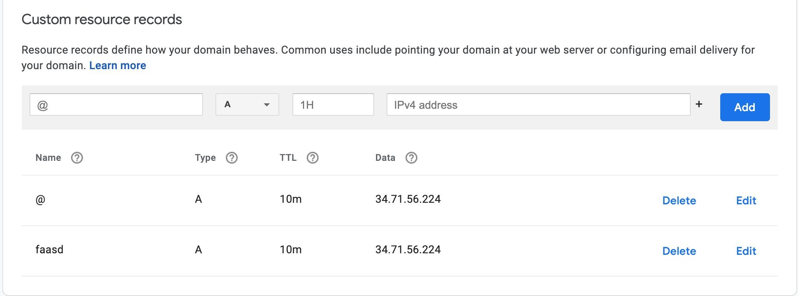

# Running on faasd running on a Raspberry Pi with TLS!

> We are assuming you already have your SD card flashed for your Raspberry Pi with the latest version of Raspbian

## Enable container features on your Pi
To enable container features in the kernel, edit the `/boot/cmdline.txt` and add the following to the end of the line, making sure not to add any new lines to the end.
```
cgroup_enable=cpuset cgroup_memory=1 cgroup_enable=memory
```
Now reboot your Pi

## Get faasd
We need the faasd source code to get started.

```bash
# Install git
sudo apt update && \
sudo apt install git -y

# Clone the faasd repo to your Pi
git clone https://github.com/openfaas/faasd.git
```

We can install faasd the easy way with as shell script, or do it the hard manual way. We're going to do it the easy way for this tutorial.
```bash
cd faasd
sudo ./hack/install.sh
```
This shoud get faasd and all of it's dependecies up and running on your Pi.
> You should get the password for the OpenFaaS gateway in the output, take a note of it.

## Install inletsctl to for an exit node to expose our Pi to the internet!

We're going to install inletsctl that would let us download inlets-pro on our Pi and create an exit-node on a cloud provider of our choice with inlets-pro server running as a systemd service, all of this just with a single command!
You can learn more about inletsctl and the inlets project at [inlets.dev](https://inlets.dev)

```bash
# Install directly to /usr/local/bin/
curl -sLSf https://inletsctl.inlets.dev | sudo sh
```

Lets' create an exit-node for our Pi on Google Compute Engine, that default to the f1-micro instance, making it almost free for us to run.

```bash
# Get current projectID
export PROJECTID=$(gcloud config get-value core/project 2>/dev/null)

# Create a service account
gcloud iam service-accounts create inlets \
--description "inlets-operator service account" \
--display-name "inlets"

# Get service account email
export SERVICEACCOUNT=$(gcloud iam service-accounts list | grep inlets | awk '{print $2}')

# Assign appropriate roles to inlets service account
gcloud projects add-iam-policy-binding $PROJECTID \
--member serviceAccount:$SERVICEACCOUNT \
--role roles/compute.admin

gcloud projects add-iam-policy-binding $PROJECTID \
--member serviceAccount:$SERVICEACCOUNT \
--role roles/iam.serviceAccountUser

# Create inlets service account key file
gcloud iam service-accounts keys create key.json \
--iam-account $SERVICEACCOUNT

# Create a TCP tunnel with inlets-pro
inletsctl create --pro -p gce -p $PROJECTID -f=key.json

# Download inlets-pro binary
inletsctl download --pro
```

## Setup inlets-pro to connect with our exit-node
We're going to setup inlets-pro with systemd so the inlets-pro running as the client on our Pi restarts and reconnects automatically when we reboot out Pi.

Create an environment file at `/etc/default/inlets-pro` with the following contents:
```
LICENSE="<your_inlets-pro_license_goes_here>"
PORTS="8080"
UPSTREAM="127.0.0.1"
TOKEN=="<the token you got from the inletsctl create command>"
URL="wss://<external_ip_addr_of_the_provisioned_exit_node>:8123/connect"
```

Create  a systemd inlets.service file at `/etc/systemd/system/inlets-pro.service` with the following contents:
```
[Unit]
Description=inlets PRO client
After=network.target

[Service]
Type=simple
Restart=always
RestartSec=2
StartLimitInterval=0
EnvironmentFile=/etc/default/inlets-pro
ExecStart=/usr/local/bin/inlets-pro client --url "${URL}" --token "${TOKEN}" --license "${LICENSE}" --upstream "${UPSTREAM}" --ports "${PORTS}"

[Install]
WantedBy=multi-user.target
```

Enable and start the inlets-pro.service
```bash
# reload systemd
sudo systemctl daemon-reload

# enable inlets-pro service
sudo systemctl enable inlets-pro

# start inlets-pro service
sudo systemctl start inlets-pro

# check if inlets-pro is running
sudo systemctl status inlets-pro
```

## Configure DNS
Add a DNS type A record pointing to the public IP address of your exit node. Since I got my domain (utsavanand.com) from Google domains and I want faasd accessible at https://faasd.utsavanand.com, I have my DNS configured as follows


## Setup caddy on the exit-node with systemd
SSH into the exit-node, and download caddy
```bash
# SSH into the exit-node
ssh <username>@<external_ip_addr_of_exit-node>

# Download the amd64 compatible caddy tar.gz from Github Releases
curl -sSLf https://github.com/caddyserver/caddy/releases/download/v2.2.1/caddy_2.2.1_linux_amd64.tar.gz -o caddy_2.2.1_linux_amd64.tar.gz

# Untar the caddy binary
tar -xvf caddy_2.2.1_linux_amd64.tar.gz --strip-components=0 -C ./

# Move the caddy binar to /usr/local/bin
sudo mv caddy /usr/bin/caddy

# Create a group named caddy
sudo groupadd --system caddy

# Create a user named caddy, with a writable home foler
sudo useradd --system \
    --gid caddy \
    --create-home \
    --home-dir /var/lib/caddy \
    --shell /usr/sbin/nologin \
    --comment "Caddy web server" \
    caddy

# Create a systemd file caddy
sudo nano /etc/systemd/system/caddy.service

# Add the following contents
# (replace the domain faasd.utsavanand.com with your own)
[Unit]
Description=Caddy
Documentation=https://caddyserver.com/docs/
After=network.target network-online.target
Requires=network-online.target

[Service]
User=caddy
Group=caddy
ExecStart=/usr/bin/caddy reverse-proxy --from faasd.utsavanand.com --to 127.0.0.1:8080
ExecReload=/usr/bin/caddy reverse-proxy --from faasd.utsavanand.com --to 127.0.0.1:8080
TimeoutStopSec=5s
LimitNOFILE=1048576
LimitNPROC=512
PrivateTmp=true
ProtectSystem=full
AmbientCapabilities=CAP_NET_BIND_SERVICE

[Install]
WantedBy=multi-user.target

# Reload systemd and start caddy with systemd
sudo systemctl daemon-reload
sudo systemctl enable caddy
sudo systemctl start caddy

# Verify if caddy is running
sudo systemctl status caddy
```
This should make caddy provision a TLS cert for your exit-node.

## Login to the OpenFaaS gateway with faas-cli

First make sure you have the latest version of faas-cli installed on your local machine, if not download and install with:
```bash
curl -sSL https://cli.openfaas.com | sudo sh
```
Login to the OpenFaaS gateway
```bash
export OPENFAAS_URL=https://<your-domain>
echo $PASSWORD | faas-cli login --password-stdin
```
